# Simulateur de Boîtiers Intelligents

  Architecture

Le projet implémente une architecture distribuée basée sur :
- *Python* : Logique métier et algorithmes de simulation
- *Flask* : API REST pour le contrôle des simulations
- *Apache Kafka* : Communication asynchrone et messagerie
- *MongoDB* : Persistance des données et logs centralisés

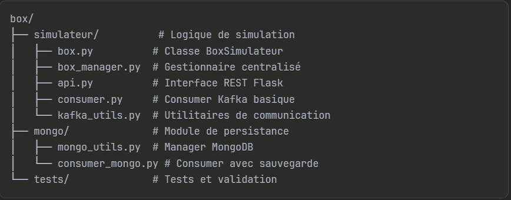

# Collections MongoDB

Le système utilise 3 collections dans la base `iot_project` :
- *boxes* : Métadonnées des boîtiers (configuration, statut, timestamps)
- *sensor_data* : Mesures en temps réel (capteurs, relais, compteurs)
- *logs* : Sauvegarde des événements système (créations, erreurs, démarrages, déconnexion réseau)

# Endpoints API

##Gestion des boîtiers
- `GET /api/boxes` - Liste tous les boîtiers
- `POST /api/boxes` - Créer un nouveau boîtier
- `GET /api/boxes/{id}` - Détails d'un boîtier
- `DELETE /api/boxes/{id}` - Supprimer un boîtier

# Contrôle des simulations
- `POST /api/boxes/{id}/simulation/start` - Démarrer une simulation
- `POST /api/boxes/{id}/simulation/stop` - Arrêter une simulation

# Informations système
- `GET /api/status` - Statut global du système
- `GET /api/capteurs/available` - Types de capteurs disponibles
- `GET /api/compteurs/available` - Types de compteurs disponibles

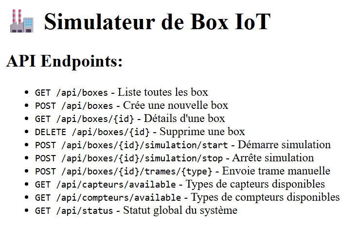

##  Exemple d'utilisation

### 1. Démarrer Kafka
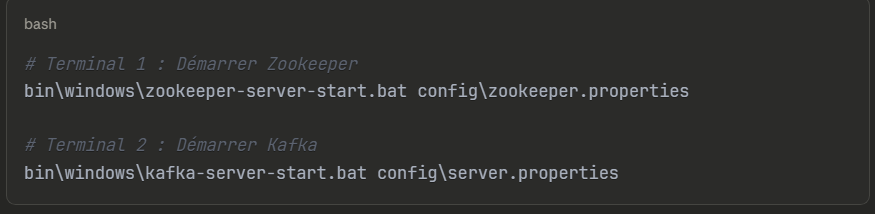

### 2. Lancer l'API
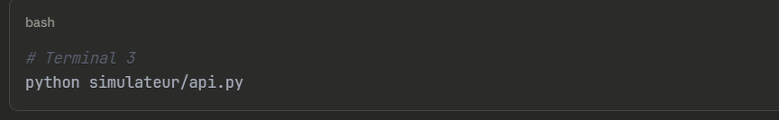

L'API sera accessible sur : `http://localhost:5000`

### 3. Démarrer le consumer MongoDB

### 4. Créer un boîtier virtuel
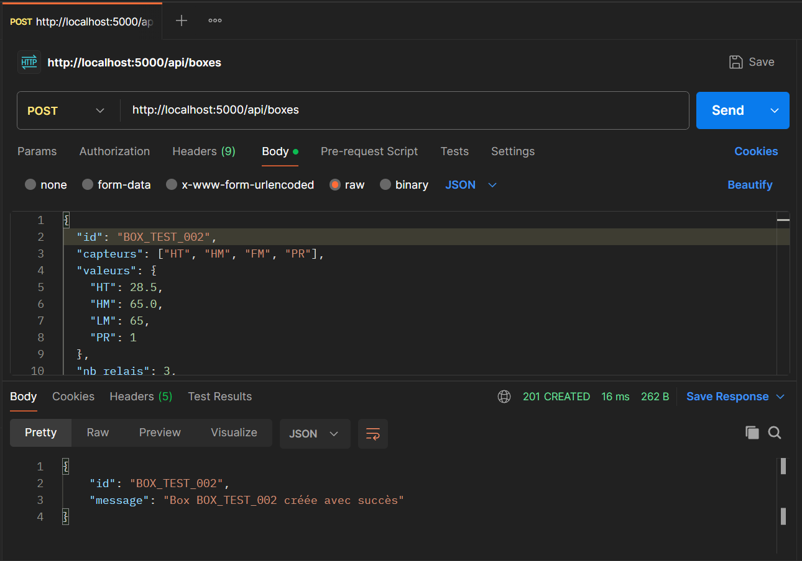

Une fois la requête validée, le système sauvegarde automatiquement les données du boîtier dans la collection MongoDB `boxes`.

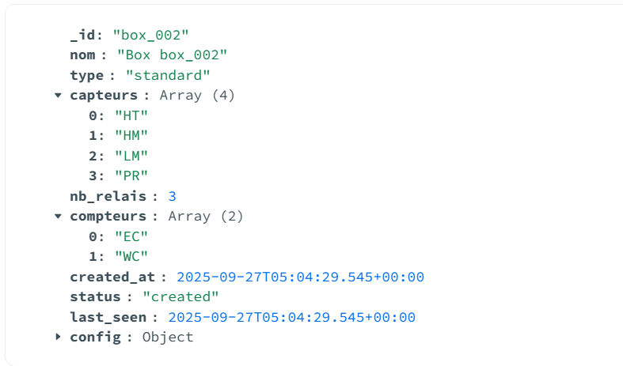

Parallèlement, le système enregistre l'événement de création dans la collection `logs` pour assurer la traçabilité des opérations.

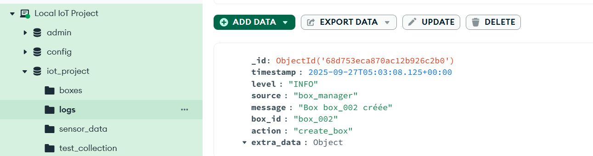

### 5. Démarrage de simulation

Le lancement d'une simulation via une requête POST adressée à l'endpoint `/api/boxes/BOX_002/simulation/start` avec un intervalle configuré.

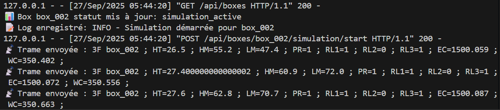

Simultanément au démarrage de la simulation, l'événement correspondant est enregistré dans la collection `logs` afin d'assurer la traçabilité de cette opération.

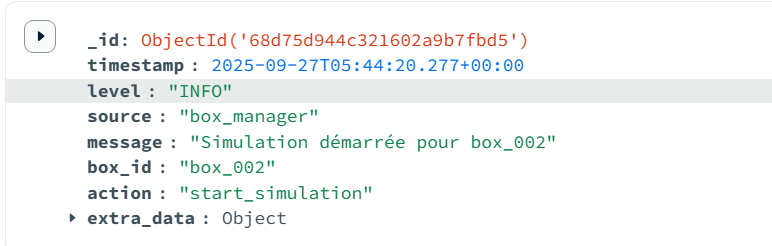

Une fois la simulation active, le consumer MongoDB traite en temps réel les trames reçues depuis Kafka. Il analyse automatiquement les données et les sauvegarde dans la collection `sensor_data`.

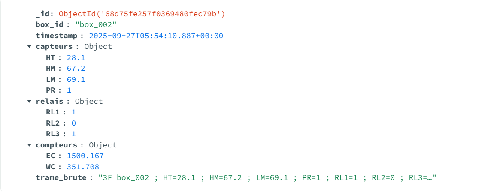

##  Exemple de détection de déconnexion Kafka

Le système fonctionne normalement avec envoi et réception des messages. Ensuite nous procédons à l'arrêt du service Kafka en utulisant :

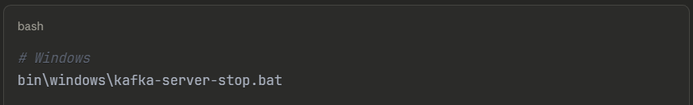

Le système de logs enregistre l'événement de panne dans la collection `logs`.

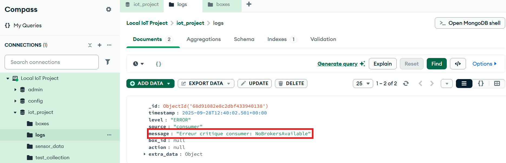

